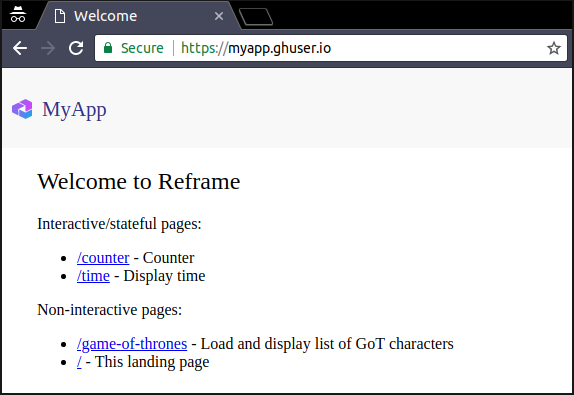

<p align="center">
  <a href="https://github.com/AurelienLourot/reframe-on-up">
    
  </a>
</p>
<p align="center">
  <b>Reframe on Up</b>
</p>
<p align="center">
  How I set up a custom domain for my Reframe web app
</p>
<p align="right">
  <a href="https://github.com/AurelienLourot">AurelienLourot</a> - 17 Jun 2018
</p>

⇐ [Part I: How I deployed for free a Reframe web app on Up in less than an hour](../01-deploy/)

In the first part of this [series](../readme.md) we have

* created a [Reframe](https://github.com/reframejs/reframe) web app,
* set up our AWS account,
* set up our AWS CLI client,
* set up our [Up](https://up.docs.apex.sh/) client, and
* deployed our app on [AWS Lambda](https://docs.aws.amazon.com/lambda/latest/dg/welcome.html) via
  Up.

In this part we will now set up a
[custom domain](https://up.docs.apex.sh/#configuration.stages_custom_domains) on top of it.

# Step-by-step guide

## Buying a domain name

1. Buy a domain name on AWS ([ghuser.io](https://ghuser.io) in this example):

```bash
$ export CONTACT="FirstName=My,LastName=User,ContactType=PERSON,OrganizationName=,\
  AddressLine1=42 My Street,AddressLine2=,City=Berlin,State=,CountryCode=DE,ZipCode=12345,\
  PhoneNumber=+49.1234567890,Email=myuser@gmail.com,Fax=,ExtraParams=[]"
$ aws route53domains register-domain --domain-name ghuser.io --duration-in-years 1 \
  --auto-renew --admin-contact "$CONTACT" --registrant-contact "$CONTACT" \
  --tech-contact "$CONTACT" --privacy-protect-admin-contact --privacy-protect-registrant-contact
```

> **NOTE**: We're not using `--privacy-protect-tech-contact`, i.e. we're not making the technical
> contact details secret on [WHOIS](https://en.wikipedia.org/wiki/WHOIS), which will be useful in a
> later step.

## Setting up Up

2. Tell Up to deploy on your custom domain by adding this to your [up.json](up.json):

```json
{
  "...": "...",
  "stages": {
    "staging": {
      "domain": "myapp.ghuser.io"
    }
  }
}
```

> **NOTE**: [It doesn't have to be a sub-domain](https://up.docs.apex.sh/#guides.development_to_production_workflow.mapping_custom_domains_to_stages)
> like `myapp.ghuser.io`. `ghuser.io` is also fine.

3. Ask [AWS Certificate Manager](https://docs.aws.amazon.com/acm/latest/userguide/acm-overview.html)
   (ACM) to create your SSL/TLS certificate:

```bash
$ ./up stack plan

       domains: Check your email for certificate approval
     ⠧ confirm: ghuser.io
```

4. Prove ownership of the domain name:

At this point the
[certification authority](https://en.wikipedia.org/wiki/Certificate_authority) (here AWS) needs you
to prove that you own the domain name (which you bought here from AWS).

> **NOTE**: Although this is a normal procedure, I wished AWS had taken us out of the loop: as a
> certification authority they already know that we own [ghuser.io](https://ghuser.io) since we
> bought it from them.

For you to do so, it has sent an e-mail to these 8 addresses:

* 5 @ghuser.io addresses (e.g. admin@ghuser.io), but we don't have any e-mail server running, so we
  will never get them.
* The admin contact from [step 1](#buying-a-domain-name) if ACM can find it on WHOIS, but we used
  `--privacy-protect-admin-contact`, so this won't work.
* The registrant contact from [step 1](#buying-a-domain-name) if ACM can find it on WHOIS, but we
  used `--privacy-protect-registrant-contact`, so this won't work.
* The technical contact from [step 1](#buying-a-domain-name) if ACM can find it on WHOIS. That's why
  we have decided not to hide this information on WHOIS.

In my case though AWS bought [ghuser.io](https://ghuser.io) from the registrar
[Gandi](https://www.gandi.net) who hides your information on WHOIS in any case. So I didn't receive
any e-mail at all. Luckily there is another way to prove ownership:
[validation via DNS](https://docs.aws.amazon.com/acm/latest/userguide/gs-acm-validate-dns.html). In
your [ACM dashboard](https://console.aws.amazon.com/acm/home) you should see your domain in the
`Pending validation` state, with the possibility to create a special
[CNAME record](https://en.wikipedia.org/wiki/CNAME_record) like
`_fd72780b18076ccf5f75a49256c69353.ghuser.io` to prove ownership.

To do so, create a file [aws/dns_upsert.json](aws/dns_upsert.json) containing

```json
{
  "Comment": "Updates existing CNAME record for ACM validation",
  "Changes": [
    {
      "Action": "UPSERT",
      "ResourceRecordSet": {
        "Name": "_fd72780b18076ccf5f75a49256c69353.ghuser.io.",
        "Type": "CNAME",
        "TTL": 300,
        "ResourceRecords": [
          {
            "Value": "_263f4205641205f64761418f33de1366.acm-validations.aws."
          }
        ]
      }
    }
  ]
}
```

and run

```bash
$ aws route53 list-hosted-zones | grep ghuser.io -B1
            "Id": "/hostedzone/Z2XLL8YMM7K4J0", 
            "Name": "ghuser.io."
$ aws route53 change-resource-record-sets --hosted-zone-id /hostedzone/Z2XLL8YMM7K4J0 \
  --change-batch "file://$(pwd)/aws/dns_upsert.json"
```

The `./up stack plan` command which was hanging will now proceed and print all changes that need to
be applied on AWS.

5. Apply these changes:

```bash
$ ./up stack apply
```

## Deploying your app

6. Enjoy :)

```bash
$ npm run deploy
```


